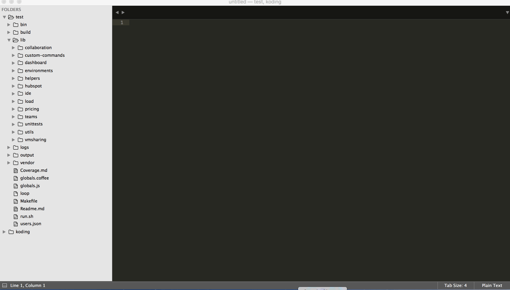

## Automated Tests in Koding
 This document will guide you through setting up and  writing integration test using [Nightwatch.js](http://nightwatchjs.org)  
 
 Nightwatch.js is an easy to use Node.js based End-to-End (E2E) testing framework for browser based websites. It uses the [Selenium WebDriver API](https://github.com/SeleniumHQ/selenium/wiki/JsonWireProtocol) to perform commands and assertions on DOM elements. You can find all commands and selenium protocol with examples in [Nightwatch API](http://nightwatchjs.org/api). You will see that how easy to write a integration test in a _Quick Start_ section with a login example.

## Koding Test Cases
[Our test document](https://docs.google.com/spreadsheets/d/1QB4uj37kH2ozwWo9KWmdndvW-LVkBhRFbSjkp6EFibE/edit) includes all implemented and unimplemented test cases. When you implement the test cases, we pay you for each test case. Price may vary based on the difficulty level of test. For more information [Upwork](https://www.upwork.com/)

## Requirements
  - [selenium server jar file](https://selenium-release.storage.googleapis.com/index.html)
  - [nightwatch.js](http://nightwatchjs.org)
  - [firefox version 46.0 or earlier versions](https://www.mozilla.org/en-US/firefox/46.0/releasenotes/) ( we have compatible issue with latest version of firefox) 

## Setup Environment
Follow steps in  https://github.com/koding/koding in order to setup koding environment.

## Quick Start
**Writing Sample Test : Team Login Integration Test**
	
  Open terminal, pull latest version of Koding and create new branch named TestLogin
  
```sh
git pull --rebase koding master 
git checkout -b 'TestLogin'
```

  Create a ```login``` folder then create ```login.coffee``` and ```loginhelpers.coffee``` file under  ```koding/client/test/lib/``` directory.
  
```sh
mkdir client/test/lib/login
touch client/test/lib/login/login.coffee
touch client/test/lib/helpers/loginhelpers.coffee
```

Test functions should be written in ```loginhelpers.coffee```. We can test login to team in just 5 following line. Open url and wait until the login form be visible then enter team name and click login button. It will show notification because of that the team has not been created before.

```sh
module.exports =
  loginToTeam: (browser) ->
     browser
      .url url
      .waitForElementVisible loginForm, 40000
      .setValue teamNameSelector, user.teamSlug
      .click loginButton
      .assert.containsText notification, "We couldn't find your team"
```
You can copy the completed code from [loginhelpers.coffee](https://gist.github.com/ezgikaysi/981f49469b3425e6d527b6e2dc9883da)

We just call ```loginToTeam``` function in ```login.coffee```.

```sh
  module.exports =
   loginToTeam: (browser) ->
    loginhelpers.loginToTeam browser
    browser.end()
```
You can copy the completed code from [login.coffee](https://gist.github.com/ezgikaysi/59d497e077d9f1523a92fc2dd9bc133c)

### Running Tests

Execute to following line in ```Koding``` directory
```sh
./run exec client/test/run.sh login login
```




## Test Architecture
 All files related with testing is under the ```Koding/client/test``` directory.
 ```bash
Coverage.md    build          logs           users.json
Makefile       globals.coffee loop           vendor
Readme.md      globals.js     output
bin            lib            run.sh
```
 Take a look at these 2 folders and 3 files that are important in order to write test cases.

**lib:** All test files and helper files are written under this directory.  

**bin:** It includes all tests file in javascript format. When we add coffee file, it is automatically converted to javascript format. We do not add or change anything under this folder. 

**users.json:** It includes default created user information in json format. These informations are used during test. When you want to create new users, you just delete all contents of the file and then run test. When test is started to run, it will be recreated automatically.

**helpers.coffee** It includes common functions such as ```getUrl```, ```createFolder```, ```deleteFolder```, ```createFile``` etc.

**utils.coffee** It includes common functions about users such as ``generateUsers``, ``getUser``, ``getPassword``, ``getUser``

## Standardization
* Tests must be written in coffeescript and in [coffeescript-styleguide](https://github.com/koding/styleguide-coffeescript) that we are relying on.

* All functions must be in related helper file. 

* Css selectors must be defined in top of the file.

* Indentation must be 2 spaces

## License

Koding is licensed under [Apache 2.0.](https://github.com/koding/koding/blob/master/LICENSE)
